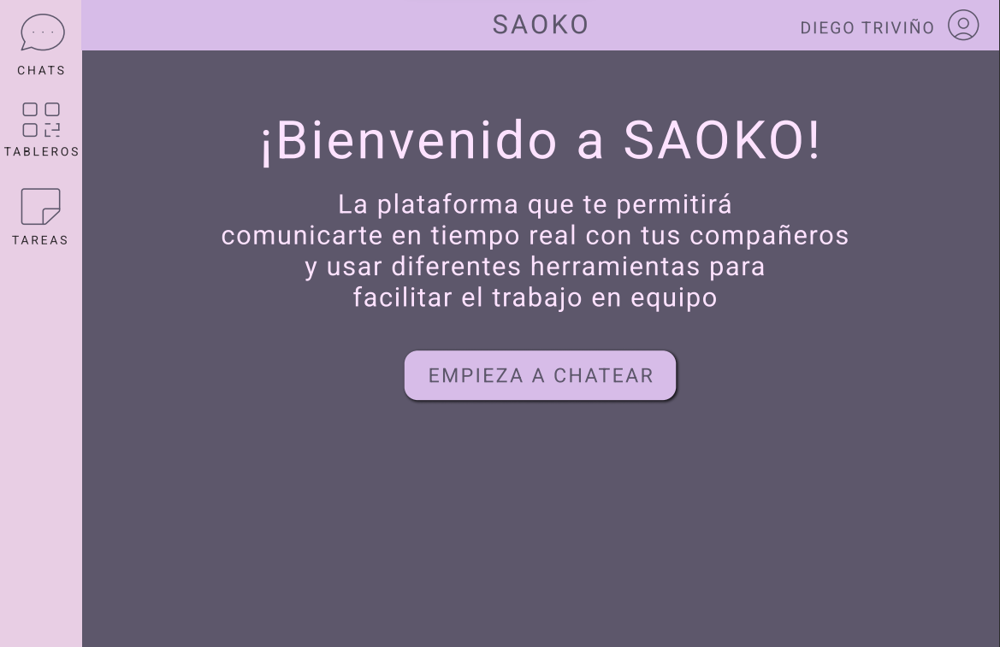

# SAOKO

## Integrantes

Laura Valentina García Leon

Juan David Murillo Giraldo

Juan Sebastian Cadavid Peralta

**Resumen** – Como seres humanos tendemos a olvidar cosas, la idea de este es que podamos tener anotadas las tareas y poder gestionar de mejor manera nuestro tiempo, para ser los más productivos posibles en el ámbito laboral como en el personal.

## Problema a resolver

Como sabemos en el mercado se encuentran muchas aplicaciones de tipo TO DO LIST que se usan para poder gestionar tareas. Pero el problema es que aparte de tener las tareas a realizar uno queda a veces con dudas o con la necesidad de crear una conversación, y se necesita hablar con el grupo de trabajo, para poder hacer esto usualmente toca con otra aplicación diferente donde se están gestionando las tareas, nuestra idea es unificar estas para poder tener todo en uno y poder resolver de manera rápida y fácil la inquietud, o ya sea para hablar de algún tema no tener que ir a otra aplicación si no que poder hacerlo directamente todo en la misma.

Como podemos ver esta es la página principal de la aplicación, a la izquierda podemos ver los chats, los tableros y las tareas. Estas serán las actividades que nuestra aplicación gestionara.

Como podemos ver en la pantalla anterior, la idea es que las tres opciones tengan esta misma opción asociada a cada una.

También podemos ver la pestaña donde gestionaremos el tema de creación de usuarios.

## Historias de usuraios

https://tree.taiga.io/project/juancho20sp-sauco/backlog

## Atributos de calidad

### Disponibilidad

Para el atributo de disponibilidad se usara un load balancer que distribuye la carga entre dos nodos idénticos, esta configuracion se realizara en la plataforma de Azure la cual nos garantiza una disponibilidad cercana del 99,995%.

Fuente: Usuario	
Estimulo: El usuario envía un mensaje 
Entorno: Ejecución mientras se mantiene abajo uno de los nodos
Respuesta: El mensaje es enviado 
Métrica: 99,9% de las peticiones son atendidas satisfactoriamente por el sistema

### Mantenibilidad

Para el atributo de mantenibilidad se implementó un flujo mediante Github Actions con análisis estático de código usando Sonar Qube para garantisar que el codigo cumpla con estandares.

Fuente: Desarrollador 
Estimulo: Agregar un nuevo servicio a la aplicación 
Entorno: Tiempo de diseño 
Respuesta: Cambio hecho y aprobado 
Métrica: Dos semanas de trabajo

### Seguridad

Para el atributo de seguridad del código se utilizó una herramienta externa de AWS llamada AWS Cognito, quien se encarga del registro, autenticación y autorización de los usuarios
